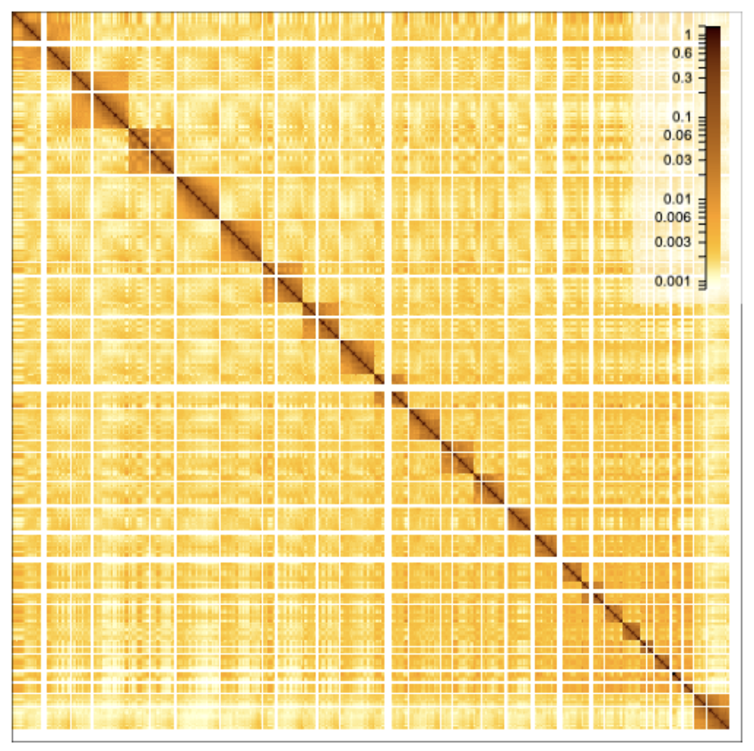

# Minimal HiGlass matrix

Can the HiGlass heatmap track be used outside of HiGlass? Yes, it can! This is a minimal example of using the heatmap track by itself.



## Local development 
```
pnpm install
pnpm run dev
```